# Messaging-App
Messaging app similar to WhatsApp using Firebase

#### Login Page
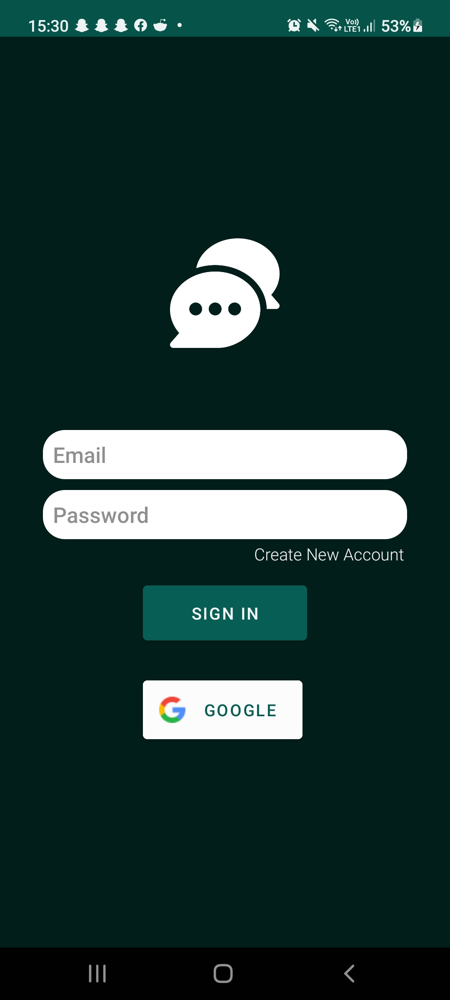  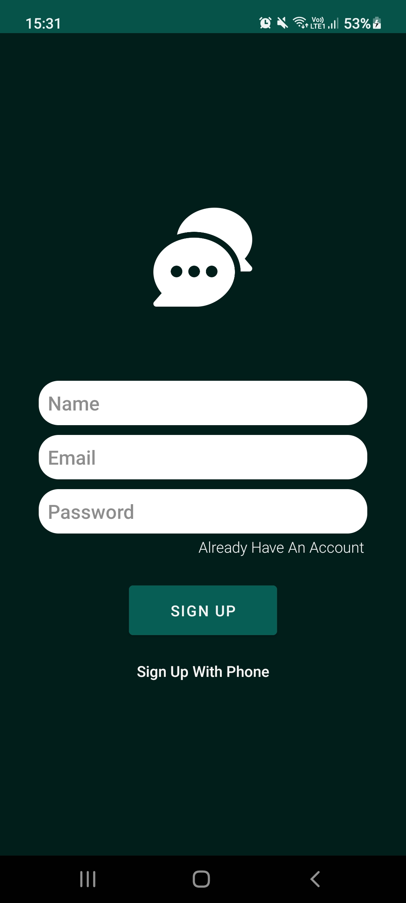  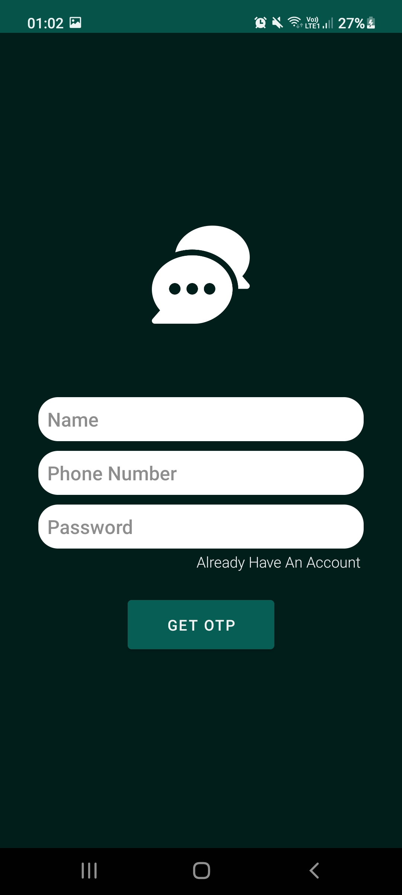  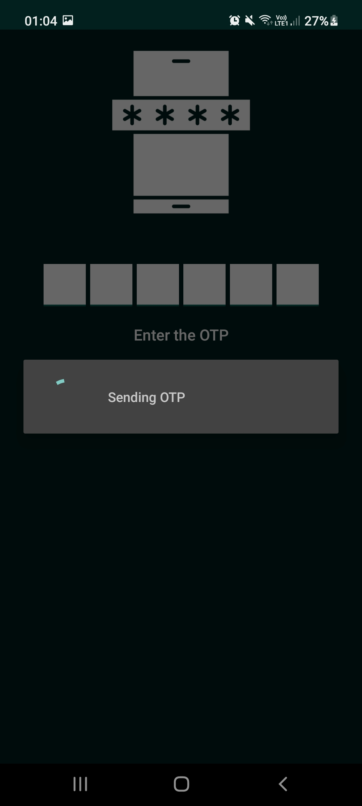  

#### Main
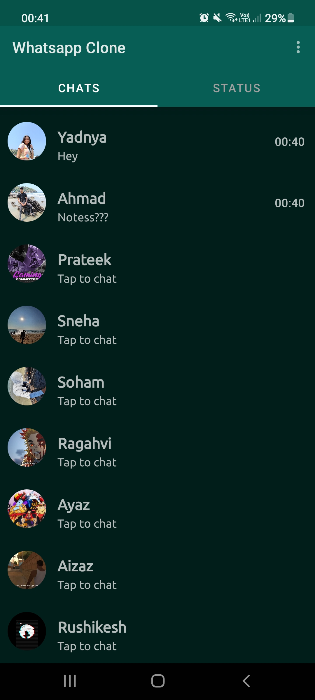  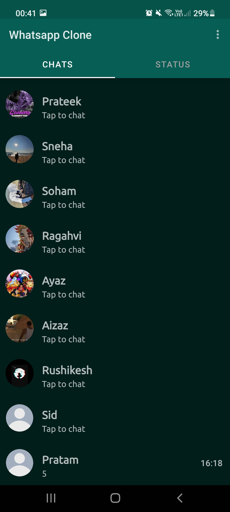  

#### Chats
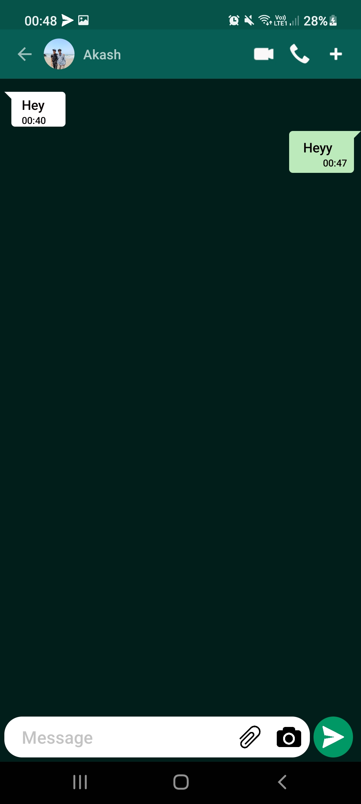  

#### Chats Notification
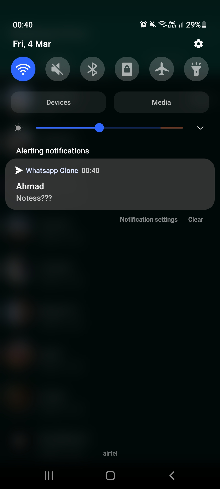  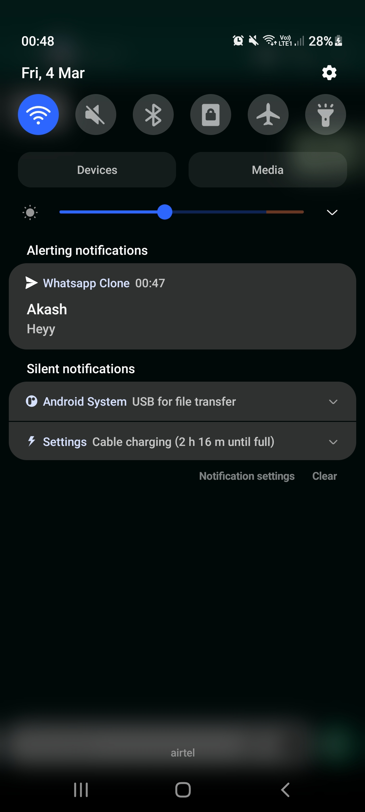  

#### Status
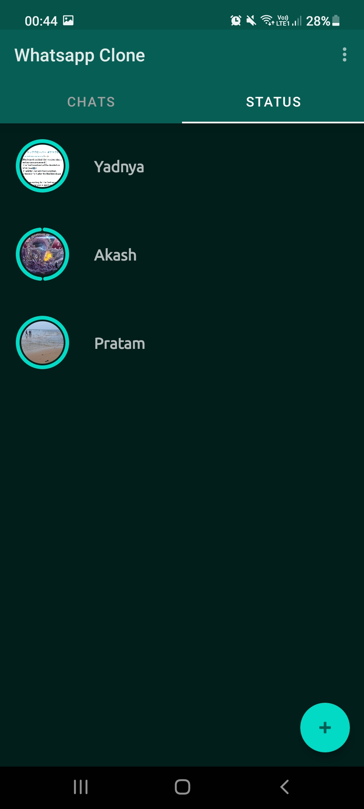 

#### Status View
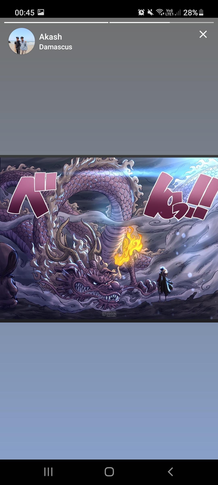  

#### Details
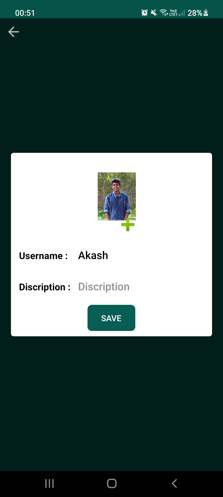  
